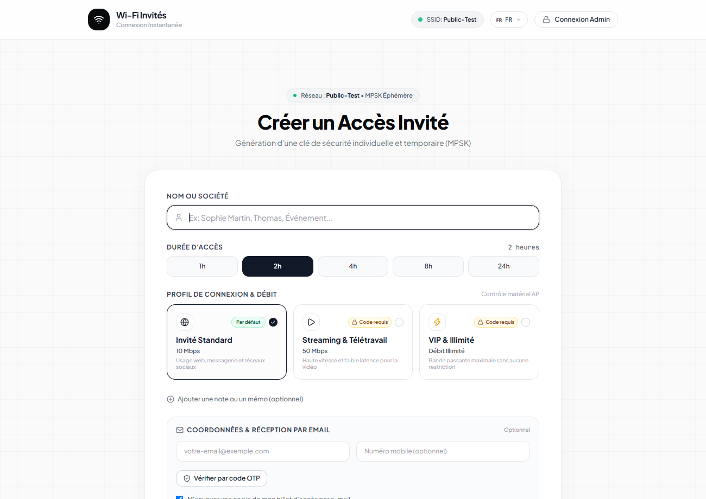
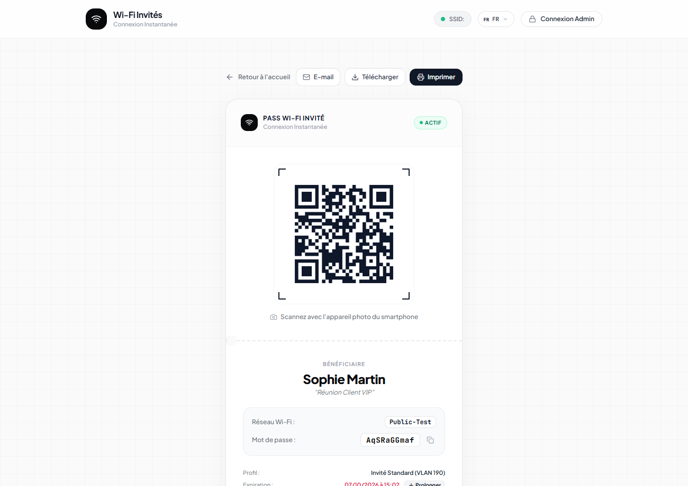
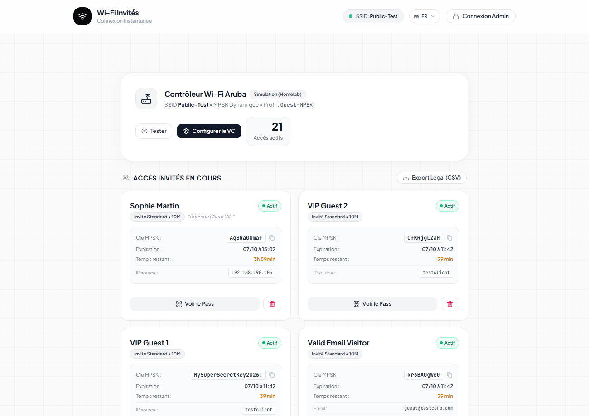
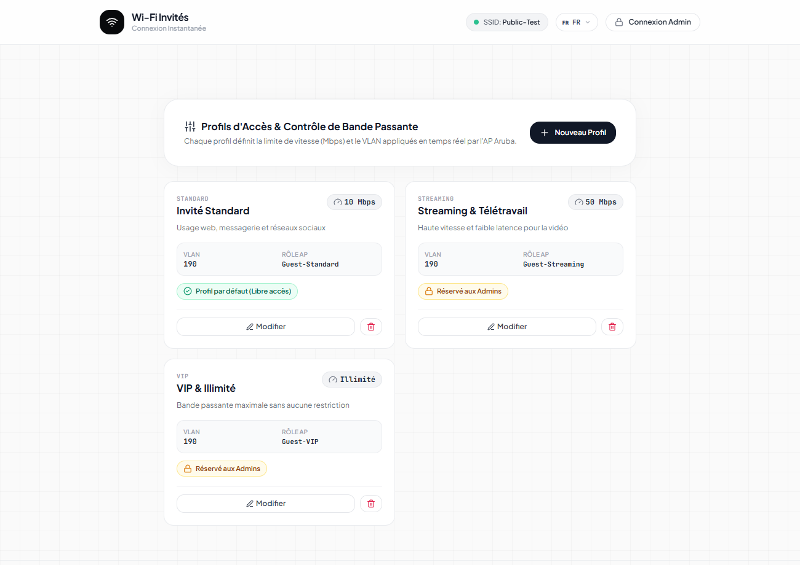
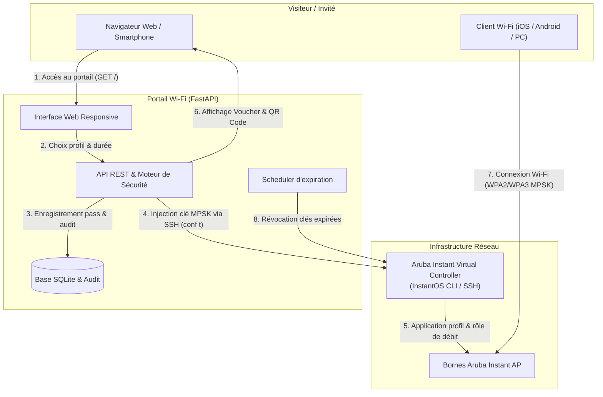

# 🚀 Enterprise & Homelab Guest Wi-Fi (Aruba Instant MPSK)

[](./LICENSE)
[](https://www.python.org/)
[](https://fastapi.tiangolo.com)
[](docker-compose.yml)
[-brightgreen.svg)](tests/test_app.py)
[]()

Portail invité moderne, sécurisé et haute performance avec provisionnement dynamique de **clés uniques par utilisateur (MPSK - Multiple Pre-Shared Key)**, limitation matérielle des débits par profil et connexion instantanée par **QR Code** pour les bornes **Aruba Instant AP (IAP / Virtual Controller)** et environnements Homelab.

---

## 📸 Aperçu de l'Interface

| 1. Portail d'accueil Visiteur | 2. Pass Wi-Fi & QR Code Universel |
| :---: | :---: |
|  |  |
| *Sélection de profil (Standard, VIP, etc.), charte d'utilisation et formulaire épuré.* | *QR Code ZXing scannable par caméra native, identifiants et décompte d'expiration.* |

| 3. Console d'Administration & Supervision | 4. Gestion des Profils & Contrats de Débit |
| :---: | :---: |
|  |  |
| *Suivi des clients en direct, bande passante consommée, déconnexion & bannissement MAC.* | *Configuration des vitesses (Up/Down), codes d'accès et synchronisation InstantOS.* |

---

## 🌟 Points Forts & Fonctionnalités

* 🔑 **Passphrase Unique par Invité (MPSK)** : chaque visiteur génère sa propre clé Wi-Fi temporaire (WPA2/WPA3-Personal). Finis les mots de passe statiques partagés ou affichés sur des post-its.
* 📱 **Connexion Instantanée par QR Code (ZXing)** : scannable nativement par les appareils photo iOS et Android sans aucune application tierce (`WIFI:T:WPA;S:...;P:...;;`).
* ⚡ **Limitation Matérielle des Débits (Aruba ASIC Shaper)** : les rôles Aruba appliquent des quotas stricts et équitables par utilisateur (`bandwidth-limit peruser`), gérés directement par le matériel de la borne.
* 🔒 **Profils d'Accès Multi-Niveaux** :
  * **Standard (Gratuit / Visiteur)** : accès direct sans friction pour les visiteurs réguliers.
  * **VIP / Haut Débit** : débit prioritaire déverrouillé par mot de passe ou code d'accès administrateur.
  * **Personnalisable** : ajout/suppression dynamique de profils depuis l'interface d'administration.
* 🛡️ **Sécurité Entreprise & RBAC avec 2FA TOTP** :
  * Rôles granulaires : **Administrateur** (droits totaux), **Opérateur** (création/gestion de pass) et **Auditeur** (consultation seule).
  * Double facteur d'authentification (2FA) via TOTP compatible Google Authenticator, Microsoft Authenticator, Apple Passwords et 1Password.
* 📡 **Supervision des Stations en Temps Réel & Bannissement MAC** :
  * Tableau de bord temps réel des clients connectés (Nom AP, niveau de signal RSSI dBm, trafic RX/TX, durée de connexion).
  * Déconnexion forcée (*kick*) en 1 clic et liste noire matérielle permanente d'adresses MAC.
* 🌐 **Détection Automatique de Langue & Support Multilingue** :
  * Détection automatique de la langue du smartphone ou navigateur (`navigator.languages` & en-tête `Accept-Language`).
  * 5 langues supportées : **Français 🇫🇷, Anglais 🇬🇧, Portugais 🇵🇹, Espagnol 🇪🇸 et Allemand 🇩🇪**.
* 📋 **Conformité Légale & Journal d'Audit (RGPD)** :
  * Traçabilité obligatoire horodatée (IP cliente, adresse MAC, nom du visiteur, parrain, date d'émission et d'expiration).
  * Modale de charte d'utilisation informatique intégrée et export conforme CSV/Excel (UTF-8) en un clic.
* ⏱️ **Nettoyage Automatique & Alertes d'Expiration** :
  * Tâche de fond révoquant automatiquement les clés échues sur la borne Aruba chaque minute.
  * Notifications par e-mail avec alerte 15 minutes avant échéance et lien de prolongation rapide.
* 🏢 **Parrainage d'Entreprise & Vérification OTP** :
  * Possibilité de restreindre le parrainage aux domaines internes de la société (`@entreprise.com`).
  * Option de vérification par code OTP e-mail à 6 chiffres.
* 🤍 **Design Épuré "Minimalist White"** :
  * Interface soignée basée sur Tailwind CSS, typographies *Plus Jakarta Sans* et *JetBrains Mono*, et icônes Lucide.
  * Version responsive pour mobile, tablette, borne tactile d'accueil et impression au format voucher/A4.

---

## 🏗️ Architecture & Flux de Fonctionnement



---

## 🐳 Déploiement Docker & Docker Compose

Le projet est entièrement conteneurisé et prêt pour la production.

### Configuration `docker-compose.yml`

Voici le fichier `docker-compose.yml` complet inclus dans le projet :

```yaml
version: '3.8'

services:
  wifi-guest:
    build: .
    container_name: wifi-guest-manager
    restart: unless-stopped
    ports:
      - "${APP_PORT:-8000}:${APP_PORT:-8000}"
    env_file:
      - .env
    volumes:
      - ./app:/app/app
      - ./wifi_guest.db:/app/wifi_guest.db
      - ./active_passes.json:/app/active_passes.json
      - ./profiles.json:/app/profiles.json
    environment:
      - APP_HOST=0.0.0.0
      - APP_PORT=${APP_PORT:-8000}
```

### Volumes persistants :
* **`./wifi_guest.db`** : Base SQLite stockant les pass, utilisateurs RBAC, secrets 2FA, journaux d'audit et paramètres dynamiques.
* **`./profiles.json`** : Configuration des profils de débit et règles de bande passante.
* **`./active_passes.json`** : État synchronisé des pass actifs.
* **`./.env`** : Fichier contenant les identifiants et variables d'environnement.

### Commandes usuelles Docker :

```bash
# 1. Copier et configurer l'environnement
cp .env.example .env

# 2. Lancer le conteneur en arrière-plan
docker compose up -d

# 3. Suivre les journaux du conteneur en direct
docker compose logs -f

# 4. Redémarrer le conteneur après mise à jour
docker compose restart

# 5. Arrêter le conteneur
docker compose down
```

> [!TIP]
> **Option `network_mode: host`** : Si votre Virtual Controller Aruba est situé sur un VLAN d'administration dédié non routé depuis le pont Docker par défaut (`172.x`), vous pouvez ajouter `network_mode: host` dans votre service `wifi-guest` dans `docker-compose.yml` pour permettre un dialogue direct avec l'IP de la borne.

---

## 📁 Structure du Projet

```text
├── app/
│   ├── aruba_client.py          # Pilotes Aruba Instant AP (SSH InstantOS) & Mode Simulation (Mock)
│   ├── auth_service.py          # Gestionnaire RBAC, hachage PBKDF2 et double facteur TOTP 2FA
│   ├── config.py                # Schémas de configuration (Pydantic Settings)
│   ├── db.py                    # Persistance SQLite, tables d'audit et réglages dynamiques
│   ├── main.py                  # Application FastAPI, routes Web et endpoints REST
│   ├── models.py                # Modèles Pydantic pour les pass, profils et utilisateurs
│   ├── notification_service.py  # Service SMTP pour e-mails de voucher et codes OTP
│   ├── profile_manager.py       # Gestionnaire de profils de vitesse et rôles InstantOS
│   ├── qr_generator.py          # Générateur universel de QR Code Wi-Fi (ZXing)
│   └── templates/
│       ├── base.html            # Gabarit principal avec détection et I18N multilingue
│       ├── index.html           # Portail invité & console d'administration unifiée
│       ├── view.html            # Voucher individuel prêt à l'impression
│       └── extend.html          # Page de prolongation d'accès
├── docs/
│   └── screenshots/             # Captures d'écran de l'interface
├── tests/
│   └── test_app.py              # Suite complète de tests unitaires et d'intégration
├── ARUBA_IAP_CONFIGURATION.md   # Guide complet pas à pas pour configurer la borne Aruba
├── aruba_iap_setup.cli          # Script CLI prêt à injecter dans la borne (conf t)
├── Dockerfile                   # Image Docker Debian Python 3.11-slim
├── docker-compose.yml           # Déploiement Docker Compose
├── requirements.txt             # Dépendances Python
├── profiles.json                # Spécification par défaut des profils de débit
├── .env.example                 # Modèle de variables d'environnement
├── CONTRIBUTING.md              # Guide de contribution
└── LICENSE                      # Licence MIT
```

---

## ⚙️ Configuration de la Borne Aruba Instant AP

Pour la configuration réseau de la borne Aruba Instant AP :

* 📖 **[ARUBA_IAP_CONFIGURATION.md](./ARUBA_IAP_CONFIGURATION.md)** : Guide exhaustif (explications CLI, WebUI, règles de pare-feu ACL, VLANs et commandes de vérification).
* ⚙️ **[aruba_iap_setup.cli](./aruba_iap_setup.cli)** : Script CLI prêt à être copié-collé dans le terminal d'administration de la borne (`conf t`).

Principe de fonctionnement avec InstantOS :
1. Définition du profil MPSK local : `wlan mpsk-local Guest-MPSK`
2. Liaison au SSID invité : `opmode mpsk-local`
3. Création des rôles avec contrat de bande passante : `wlan access-rule Guest-VIP` / `bandwidth-limit peruser ...`
4. Synchronisation automatique des passphrases par le portail via SSH : `mpsk-local-passphrase <guest_id> <password> <role>`

---

## 🚀 Démarrage Rapide en Local

### 1. Cloner le dépôt et créer l'environnement virtuel

```bash
git clone https://github.com/wybaux/aruba-mpsk-guest-portal.git
cd aruba-mpsk-guest-portal

# Créer un environnement virtuel
python -m venv .venv

# Activer l'environnement :
# Windows (PowerShell) :
.\.venv\Scripts\Activate.ps1
# Linux / macOS :
source .venv/bin/activate

# Installer les dépendances
pip install -r requirements.txt
```

### 2. Définir les variables d'environnement

Copiez `.env.example` en `.env` :

```bash
cp .env.example .env
```

Paramètres clés :
```dotenv
# Paramètres généraux
APP_TITLE=Wi-Fi Invités Homelab
APP_HOST=0.0.0.0
APP_PORT=8000
SECRET_KEY=cle_secrete_a_changer_en_production
ADMIN_PASSWORD=votre_mot_de_passe_admin

# Réseau Wi-Fi
WIFI_SSID=Public-Test

# Langue par défaut (fr, en, pt, es, de)
DEFAULT_LANGUAGE=fr

# Mode d'intégration Aruba
# instant = Borne physique Instant AP connectée via SSH
# mock    = Simulation locale autonome (idéal dev / test)
ARUBA_MODE=instant
ARUBA_INSTANT_HOST=https://10.10.30.4:4343
ARUBA_INSTANT_USERNAME=admin
ARUBA_INSTANT_PASSWORD=mot_de_passe_borne
ARUBA_INSTANT_VERIFY_SSL=false
ARUBA_MPSK_PROFILE=Guest-MPSK
```

### 3. Lancer l'application

```bash
python -m uvicorn app.main:app --host 0.0.0.0 --port 8000
```

Accédez aux interfaces dans votre navigateur :
* **Portail Invités** : `http://localhost:8000/`
* **Console d'Administration** : `http://localhost:8000/#admin`
* **Gestion des Profils de Débit** : `http://localhost:8000/?tab=profiles`
* **Gestion des Utilisateurs RBAC** : `http://localhost:8000/?tab=users`
* **Documentation Interactive OpenAPI / Swagger** : `http://localhost:8000/docs`

---

## 🔌 Endpoints API REST Principaux

| Méthode | Route | Description |
| :--- | :--- | :--- |
| `GET` | `/` | Portail HTML responsive pour visiteurs et console d'administration |
| `POST` | `/api/guests` | Création programmatique d'un pass invité avec génération de MPSK |
| `GET` | `/api/guests` | Liste de tous les pass actifs avec temps restant |
| `DELETE` | `/api/guests/{id}` | Révocation immédiate d'un pass invité et suppression de sa clé MPSK |
| `GET` | `/guest/{id}/qr.png` | Génération de l'image PNG haute résolution du QR Code Wi-Fi |
| `GET` | `/api/profiles` | Liste des profils de bande passante et statuts de protection |
| `POST` | `/api/auth/login` | Connexion utilisateur RBAC (étape 1 mot de passe, étape 2 TOTP/MFA) |
| `GET` | `/api/admin/clients` | Liste des stations Wi-Fi connectées en direct |
| `POST` | `/api/admin/clients/disconnect` | Déconnexion forcée (*kick*) d'un appareil par son adresse MAC |
| `POST` | `/api/admin/clients/blacklist` | Bannissement matériel permanent d'une adresse MAC |

---

## 🧪 Tests & Qualité de Code

La suite de tests automatisée valide l'intégralité du cycle de vie des pass, l'authentification RBAC avec TOTP 2FA, les profils de débit et les scénarios de secours :

```bash
python -m pytest tests/test_app.py -v
```

> **Résultat** : 19 tests validés avec succès (100% de réussite).

---

## 🤝 Contribution

Les contributions, suggestions et retours d'expérience sont les bienvenus ! Consultez le fichier **[CONTRIBUTING.md](./CONTRIBUTING.md)** pour les consignes de développement.

---

## 📄 Licence

Ce projet est distribué sous licence open-source **MIT**. Consultez le fichier **[LICENSE](./LICENSE)** pour plus de précisions.
