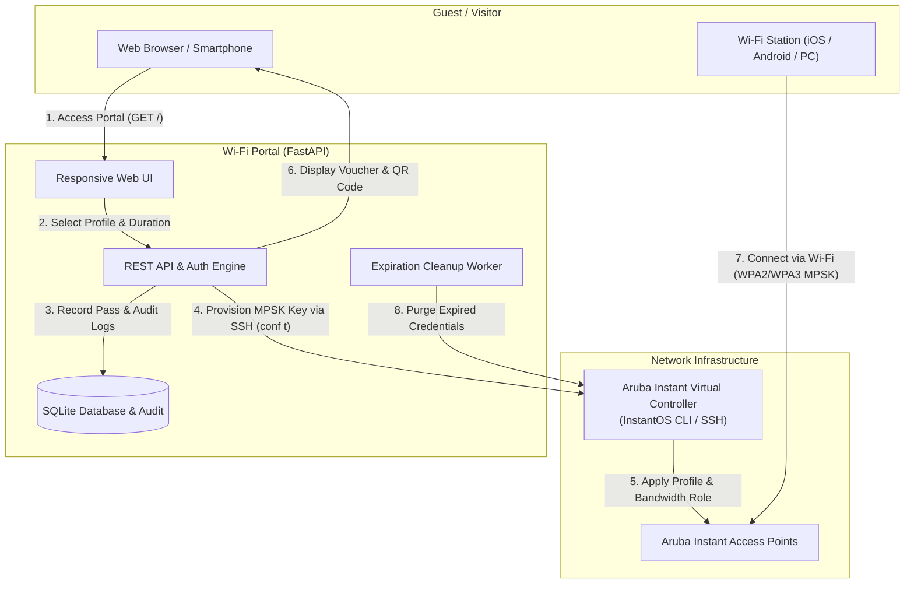

# 🚀 Enterprise & Homelab Guest Wi-Fi (Aruba Instant MPSK)

[](./LICENSE)
[](https://www.python.org/)
[](https://fastapi.tiangolo.com)
[](docker-compose.yml)
[-brightgreen.svg)](tests/test_app.py)
[]()

A modern, secure, and production-ready guest Wi-Fi portal featuring dynamic **Multiple Pre-Shared Key (MPSK)** provisioning, hardware per-user bandwidth rate-limiting, and instant camera **QR Code** onboarding for **Aruba Instant APs (IAP / Virtual Controller)** and Homelab environments.

---

## 📸 Interface Showcase

| 1. Guest Welcome Portal | 2. Wi-Fi Pass & Universal QR Code |
| :---: | :---: |
|  |  |
| *Profile selection (Standard, VIP, etc.), acceptable use charter, and clean form.* | *Instant ZXing QR Code scannable by native iOS/Android cameras with live expiration counter.* |

| 3. Admin Console & Live Monitoring | 4. Bandwidth Profiles & Shaper Contracts |
| :---: | :---: |
|  |  |
| *Real-time client monitoring, RSSI signal, bandwidth usage, 1-click kick & MAC blacklist.* | *Upload/Download speed tiers, protection passcodes, and InstantOS role mapping.* |

---

## 🌟 Key Features

* 🔑 **Unique Wi-Fi Passphrase per Guest (MPSK)**: Each visitor receives their own unique, temporary WPA2/WPA3 credential generated on the fly. No shared static passwords or handwritten post-it notes.
* 📱 **Instant Camera QR Code Connection (ZXing)**: Scannable natively by iOS and Android stock camera apps without any third-party software (`WIFI:T:WPA;S:...;P:...;;`).
* ⚡ **Hardware Rate-Limiting (Aruba ASIC Shaper)**: Dedicated Aruba user roles enforce fair, strict per-client upload/download limits (`bandwidth-limit peruser`), processed directly by the AP hardware.
* 🔒 **Multi-Tier Access Profiles**:
  * **Standard (Free / Regular)**: Instant, zero-friction access for typical guests.
  * **VIP / High-Speed**: Prioritized bandwidth tier protected by custom access codes or admin verification.
  * **Customizable**: Dynamically create, edit, or delete bandwidth profiles straight from the admin UI.
* 🛡️ **Enterprise Security & RBAC with 2FA TOTP**:
  * Granular roles: **Admin** (full management), **Operator** (guest pass creation/extension), and **Auditor** (read-only compliance).
  * Two-Factor Authentication via TOTP compatible with Google Authenticator, Microsoft Authenticator, Apple Passwords, and 1Password.
* 📡 **Real-Time Connected Clients & 1-Click MAC Ban**:
  * Live monitoring of connected clients (AP name, RSSI dBm, RX/TX traffic, connection duration).
  * Instant hardware kick / disconnect and permanent MAC hardware blacklisting.
* 🌐 **Automatic Device Language Detection & Multilingual Support**:
  * Automatically detects visitor device language (`navigator.languages` & `Accept-Language` header).
  * 5 languages fully supported: **English 🇬🇧, French 🇫🇷, Portuguese 🇵🇹, Spanish 🇪🇸, and German 🇩🇪**.
* 📋 **Legal Compliance & GDPR Audit Trail**:
  * Mandatory traceability recording client IP, exact timestamps, MAC address, sponsor, and issued key.
  * Integrated terms of use acceptance modal compliant with data retention laws and GDPR.
  * One-click compliant Excel UTF-8 CSV export.
* ⏱️ **Automated Pass Expiry & Background Cleanup**:
  * Background worker revoking expired credentials on Aruba hardware every minute.
  * Automatic 15-minute expiration warning emails with one-click renewal links.
* 🏢 **Corporate Host Sponsorship & OTP Validation**:
  * Internal employee sponsorship with company email domain enforcement (`@company.com`).
  * Optional or mandatory guest email validation via 6-digit one-time passcodes (OTP).
* 🤍 **Pure-White Minimalist Design**:
  * Clean UI engineered with *Plus Jakarta Sans*, *JetBrains Mono*, Tailwind CSS, and Lucide icons.
  * Responsive layout optimized for smartphones, desktop kiosks, and thermal/A4 printing.

---

## 🏗️ Architecture & Workflow



---

## 🐳 Docker & Docker Compose Deployment

The application is fully containerized and production-ready.

### `docker-compose.yml` Configuration

Here is the complete `docker-compose.yml` file included in the repository:

```yaml
version: '3.8'

services:
  wifi-guest:
    build: .
    container_name: wifi-guest-manager
    restart: unless-stopped
    ports:
      - "${APP_PORT:-8000}:${APP_PORT:-8000}"
    env_file:
      - .env
    volumes:
      - ./app:/app/app
      - ./wifi_guest.db:/app/wifi_guest.db
      - ./active_passes.json:/app/active_passes.json
      - ./profiles.json:/app/profiles.json
    environment:
      - APP_HOST=0.0.0.0
      - APP_PORT=${APP_PORT:-8000}
```

### Persistent Volumes:
* **`./wifi_guest.db`**: SQLite database storing passes, RBAC accounts, 2FA secrets, audit trails, and dynamic settings.
* **`./profiles.json`**: Access profile specifications and bandwidth contract rules.
* **`./active_passes.json`**: Synchronized active pass state.
* **`./.env`**: Environment file containing secrets and connection parameters.

### Common Docker Commands:

```bash
# 1. Copy and configure environment variables
cp .env.example .env

# 2. Launch container in the background
docker compose up -d

# 3. Follow live container logs
docker compose logs -f

# 4. Restart container after updates
docker compose restart

# 5. Stop container
docker compose down
```

> [!TIP]
> **`network_mode: host` Option**: If your Aruba Virtual Controller is located on a dedicated management subnet/VLAN that is not routed by default from Docker bridge (`172.x`), add `network_mode: host` to the `wifi-guest` service in `docker-compose.yml` for direct L3 communication with the AP.

---

## 📁 Project Structure

```text
├── app/
│   ├── aruba_client.py          # Aruba Instant AP driver (InstantOS SSH) & Mock Homelab engine
│   ├── auth_service.py          # RBAC authentication, PBKDF2 hashing, and TOTP 2FA engine
│   ├── config.py                # Configuration schemas (Pydantic Settings)
│   ├── db.py                    # SQLite persistence, audit trails, and dynamic settings
│   ├── main.py                  # FastAPI application, Web routes, and REST endpoints
│   ├── models.py                # Pydantic data models for passes, profiles, and users
│   ├── notification_service.py  # SMTP notification service for vouchers and OTP emails
│   ├── profile_manager.py       # Speed profile manager & InstantOS role mapping
│   ├── qr_generator.py          # Universal ZXing Wi-Fi QR Code generator
│   └── templates/
│       ├── base.html            # Main layout with I18N language switcher (EN/FR/PT/ES/DE)
│       ├── index.html           # Guest portal & unified admin management console
│       ├── view.html            # Printable individual voucher page
│       └── extend.html          # Pass extension self-service page
├── docs/
│   └── screenshots/             # High-resolution interface screenshots
├── tests/
│   └── test_app.py              # Full unit and integration test suite (Pytest)
├── ARUBA_IAP_CONFIGURATION.md   # Step-by-step Aruba Instant AP setup guide
├── aruba_iap_setup.cli          # Ready-to-paste CLI configuration script (conf t)
├── Dockerfile                   # Debian Python 3.11-slim container image
├── docker-compose.yml           # One-click Docker Compose deployment
├── requirements.txt             # Python dependencies
├── profiles.json                # Default access profile specifications
├── .env.example                 # Sanitized environment template
├── CONTRIBUTING.md              # Contributor guidelines
└── LICENSE                      # MIT Open Source License
```

---

## ⚙️ Aruba Access Point Configuration

For network configuration and Aruba Instant AP parameters:

* 📖 **[ARUBA_IAP_CONFIGURATION.md](./ARUBA_IAP_CONFIGURATION.md)**: Detailed step-by-step guide (CLI, WebUI, firewall ACLs, VLANs, and verification commands).
* ⚙️ **[aruba_iap_setup.cli](./aruba_iap_setup.cli)**: Ready-to-paste CLI configuration script (`conf t`).

InstantOS operational workflow:
1. Define local MPSK profile: `wlan mpsk-local Guest-MPSK`
2. Bind to guest SSID: `opmode mpsk-local`
3. Configure roles with bandwidth contracts: `wlan access-rule Guest-VIP` / `bandwidth-limit peruser ...`
4. Automated passphrase provisioning over SSH: `mpsk-local-passphrase <guest_id> <password> <role>`

---

## 🚀 Local Quick Start

### 1. Clone repository & create virtual environment

```bash
git clone https://github.com/wybaux/aruba-mpsk-guest-portal.git
cd aruba-mpsk-guest-portal

# Create virtual environment
python -m venv .venv

# Activate environment:
# On Windows (PowerShell):
.\.venv\Scripts\Activate.ps1
# On Linux / macOS:
source .venv/bin/activate

# Install dependencies
pip install -r requirements.txt
```

### 2. Configure environment variables

Copy `.env.example` to `.env`:

```bash
cp .env.example .env
```

Key configuration parameters:
```dotenv
# General Settings
APP_TITLE=Wi-Fi Guest Portal
APP_HOST=0.0.0.0
APP_PORT=8000
SECRET_KEY=change_this_secret_key_in_production
ADMIN_PASSWORD=your_admin_password

# Wi-Fi SSID
WIFI_SSID=Public-Test

# Default Language (en, fr, pt, es, de)
DEFAULT_LANGUAGE=en

# Aruba Mode
# instant = Physical AP connected via SSH
# mock    = Offline local simulation (ideal for dev & testing)
ARUBA_MODE=instant
ARUBA_INSTANT_HOST=https://10.10.30.4:4343
ARUBA_INSTANT_USERNAME=admin
ARUBA_INSTANT_PASSWORD=your_ap_password
ARUBA_INSTANT_VERIFY_SSL=false
ARUBA_MPSK_PROFILE=Guest-MPSK
```

### 3. Run the application

```bash
python -m uvicorn app.main:app --host 0.0.0.0 --port 8000
```

Open your browser:
* **Guest Portal**: `http://localhost:8000/`
* **Admin Console**: `http://localhost:8000/#admin`
* **Bandwidth Profiles**: `http://localhost:8000/?tab=profiles`
* **User Management**: `http://localhost:8000/?tab=users`
* **Interactive OpenAPI Specs**: `http://localhost:8000/docs`

---

## 🔌 Main REST API Endpoints

| Method | Endpoint | Description |
| :--- | :--- | :--- |
| `GET` | `/` | Responsive HTML guest portal and admin management console |
| `POST` | `/api/guests` | Programmatic guest pass creation with unique MPSK key |
| `GET` | `/api/guests` | List all active guest passes with remaining validity |
| `DELETE` | `/api/guests/{id}` | Instant pass revocation and MPSK passphrase removal |
| `GET` | `/guest/{id}/qr.png` | High-resolution PNG Wi-Fi QR Code generation |
| `GET` | `/api/profiles` | List bandwidth tiers and protection statuses |
| `POST` | `/api/auth/login` | RBAC authentication (Step 1 password, Step 2 TOTP/MFA) |
| `GET` | `/api/admin/clients` | Live list of currently connected Wi-Fi stations |
| `POST` | `/api/admin/clients/disconnect` | Forceful client disconnect (*kick*) by MAC address |
| `POST` | `/api/admin/clients/blacklist` | Permanent hardware blacklisting by MAC address |

---

## 🧪 Tests & Code Quality

The automated test suite verifies the complete pass lifecycle, RBAC authentication with TOTP 2FA, bandwidth profiles, and fallback scenarios:

```bash
python -m pytest tests/test_app.py -v
```

> **Test Summary**: 19 passed (100% pass rate).

---

## 🤝 Contributing

Contributions, issues, and feature requests are welcome! Check **[CONTRIBUTING.md](./CONTRIBUTING.md)** for development guidelines.

---

## 📄 License

This project is licensed under the **MIT License**. See **[LICENSE](./LICENSE)** for details.
